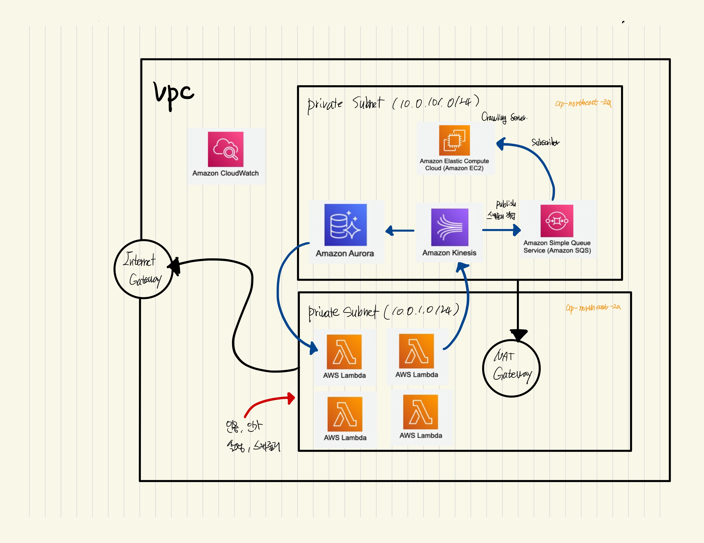

# Tech-news

## Architecture

### 현재 Tech 뉴스 구조

- Lambda 서버내에서 인증 및 설정작업
- Amazona Kinesis 를 중계기로 사용하여 데이터베이스 적재 및 SQS Publish
- SQS를 활용하여 EC2 서버에서 Crawling

## Folder

- infra
  - aws infra use terrafrom
- instance
  - crawling server use ec2
- lambda
  - auth, main server use aws lambda

## Todo

- Lambda

  - [ ] Auth
    - [ ] 회원가입
    - [ ] 로그인
    - [ ] 아이디 찾기
    - [ ] 비밀번호 변경
  - [ ] Main
    - [ ] Category 선택
    - [ ] 바로 보기 (channel -> expired 3600)

- Crawling
  - [ ] send to Email Crawling News
    - [ ] Email Verifier
