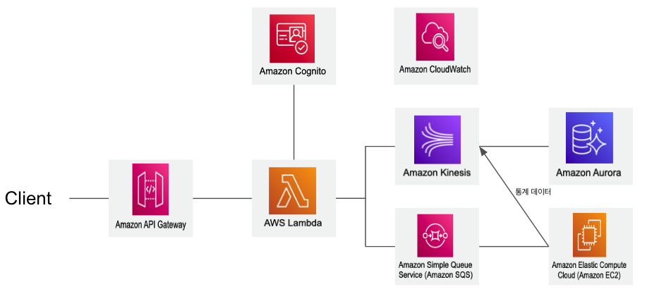

# Tech-news

## Desc

- 원하는 카테고리의 뉴스나 새로운 소식을 먼저 접해보자!!
- Channel
  - Email
  - 텔레그램
  - 카카오톡

## Flow

## Todo

> 기능

- [ ] 유저 인증
- [ ] 토큰 재발급 n 일
- [ ] 유저 채널 관리 (채널 다중선택은 추후...)
- [ ] 스케쥴링
- [ ] 스케쥴링 실패 시 -> fail 관리

> Function

- [ ] Auth
- [ ] Crawling (Puppeteer)
- [ ] Optimize Crawling

> Cloud

- [ ] Setting AWS Lambda use Terraform
- [ ] Setting AWS Serverless Aurora DB use Terraform
- [ ] Schduler

## Desc

- 카테고리 체크
- 코드 검색
- 코드 결과 반환
- 카테고리 추천

## DB Schema

